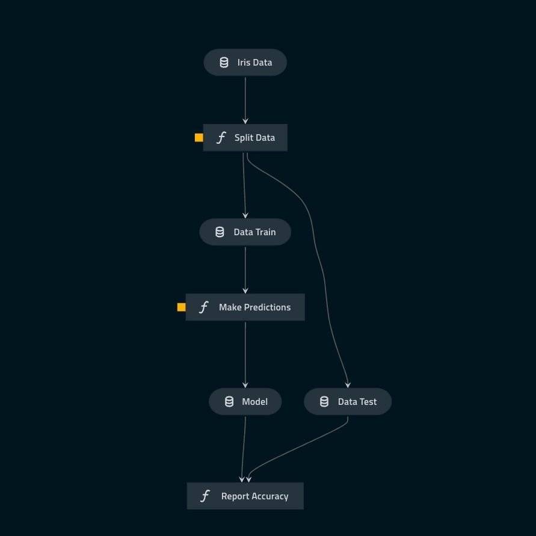
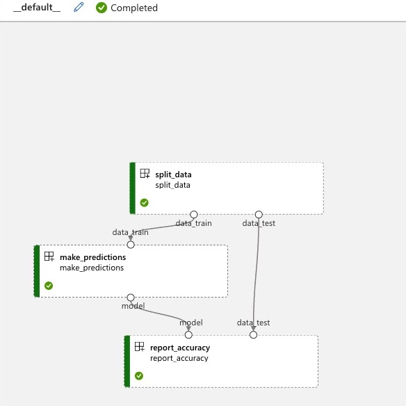
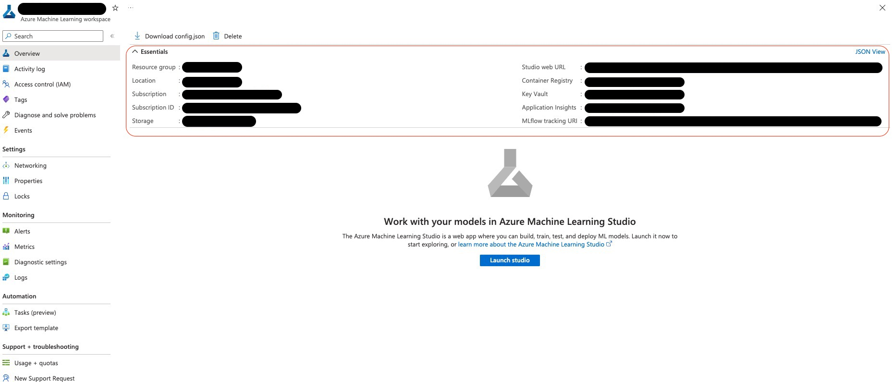

# Kedro Azureml Starter
This repo is a starter template for a Kedro project that can run its pipelines both locally and on AzureML.
To run on AzureML pipelines, we use the [kedro-azureml](https://kedro-azureml.readthedocs.io/) plugin.
This plugin automatically translates your Kedro pipeline into an AzureML pipeline:

Kedro pipeline             |  AzureML Pipeline
:-------------------------:|:-------------------------:
  | 

Quickly want to try this out? This starter can automatically generate the above pipeline for you. Just follow the instructions below. 

## Requirements for this starter
- Python 3.8+
- A terminal with the [Azure CLI](https://learn.microsoft.com/en-us/cli/azure/install-azure-cli?view=azure-cli-latest) installed. 
- kedro >= 0.18.4. You can install kedro using [pipx](https://github.com/pypa/pipx), pip or conda:
```bash
pipx install kedro
```
or
```bash
python -m venv .venv
source .venv/bin/activate
pip install kedro
```
or
```bash
conda create -n kedro python=3.10
conda activate kedro
pip install kedro
```

## Starting a new kedro project
Before starting a new kedro project, make sure you have a Azure Machine Learning Workspace with a compute cluster.
The starter will ask you like:
- Your AzureML Workspace name.
- Your AzureML Workspace resource group.
- Your blob storage account name and container name. Here we will store the temporary files for the pipeline.
- Your AzureML compute cluster name. This will be the default compute cluster for your pipeline steps.
- Your Container Registry name.

When it has all the information, you can create the project with the following command:

```bash
kedro new \
  --starter=https://github.com/godatadriven/kedro-azureml-starter \
  --checkout main
```
All the remaining instructions will be in the generated README.md file.

## FAQ

### Where can I find the names for all the resources?
You can find the names of all the resources in the [Azure Portal](https://portal.azure.com/).
Then, find your AzureML Workspace.
Here there should be an area called essentials.
This should contain all the needed information.



### I have a ML Workspace, but I don't have a compute cluster. How can I create one?
Go to your [ML Workspace](https://ml.azure.com/).
When you are in your workspace, click on the compute tab in the left menu.
Then click on the button **compute cluster** tab (**not** the compute instance tab).
Click on the **+ New** button and follow the instructions.
