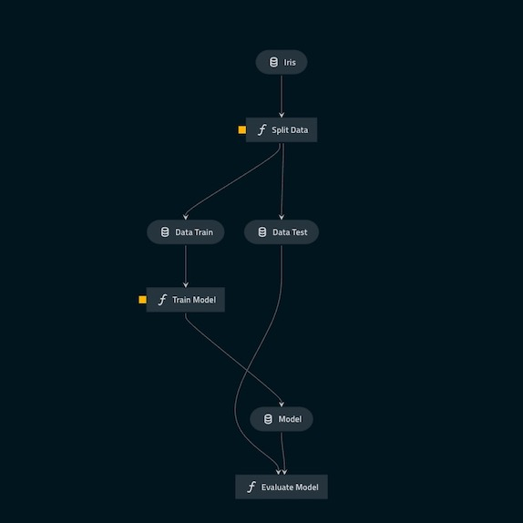
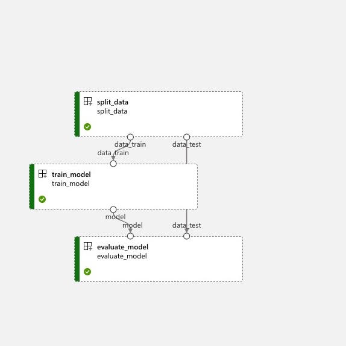

# Kedro AzureML Starter Tutorial
TODO: remove duplicate info from README.md and {{cookiecutter.repo_name}}/README.md.

The goal of this tutorial is to see how you can refactor a simple `train.py` file into Kedro pipelines.
It might seem a bit like over-engineering, but once we have done this refactoring you, we immediately see benefits like:
- The code has become more modular and easier to test.
- The code can run both locally and on AzureML.
- The code can be easily extended with additional steps.
- You can easily access the intermediate results from your pipeline in Jupiter notebooks for further analysis.
- And much more...

The simple `train.py` we will refactor is logistic regression model for the famous [iris dataset](https://scikit-learn.org/stable/auto_examples/datasets/plot_iris_dataset.html).
All this script does is load the data, train a model and evaluate it:

```python
import pandas as pd
from sklearn.linear_model import LogisticRegression
from sklearn.model_selection import train_test_split


def main() -> None:
    df = pd.read_csv("iris.csv")

    data_train, data_test = train_test_split(
        df, test_size=0.2, stratify=df["species"], random_state=42
    )

    model = train_model(data_train)
    evaluate_model(model, data_test)


def train_model(data_train: pd.DataFrame) -> LogisticRegression:
    x = data_train.drop("species", axis=1).to_numpy()
    y = data_train["species"]

    model = LogisticRegression(solver="lbfgs", C=1, random_state=42)
    model.fit(x, y)

    accuracy = model.score(x, y)
    print(f"Training Accuracy: {accuracy}")

    return model


def evaluate_model(model: LogisticRegression, data_test: pd.DataFrame) -> pd.DataFrame:
    x = data_test.drop("species", axis=1).to_numpy()
    y = data_test["species"]

    accuracy = model.score(x, y)

    print(f"Test Accuracy: {accuracy}")

if __name__ == "__main__":
    main()
```

## Prerequisites
In this tutorial we assume you have the following:
- Python 3.8+ installed.
- A terminal with the Azure CLI installed. (See [here](https://docs.microsoft.com/en-us/cli/azure/install-azure-cli) for installation instructions.)
- An Azure Resource group with the following resources:
  - An Azure Machine Learning Workspace with a compute cluster. ([Click here](https://learn.microsoft.com/en-us/azure/machine-learning/how-to-create-attach-compute-cluster?tabs=azure-studio) for more info.)
  - An Azure Container Registry.
  - An Azure Storage Account with a container.

How to create these resources is out of scope for this tutorial.
So, we assume that your IT department has created them for your or that you have created them yourself based on the [Azure documentation pages](https://learn.microsoft.com/en-us/azure/machine-learning/how-to-manage-workspace?tabs=azure-portal#create-a-workspace).

## Part 0: Setup
Before we can start with the main part of the tutorial, we first need to do some preparation.
This includes installing kedro and gathering some information about your Azure resources.

### Installing Kedro
For this tutorial you will need kedro installed as a CLI tool.
If you don't have kedro installed yet, then are three options:
- Create a new conda environment with Python 3.8+ and install kedro using pip:
    ```bash
    conda create -n kedro python=3.10
    conda activate kedro
    pip install kedro
    ```
- Create a new virtual environment and install kedro inside it using pip:
    ```bash
    python -m venv .venv
    source .venv/bin/activate
    pip install kedro
    ```
- Install kedro using [pipx](https://github.com/pypa/pipx).
  Pipx is a tool that allows you to install Python based CLI applications in isolated environments.
  Using `pipx`, you can install kedro using:
    ```bash
    pipx install kedro
    ```

After, you have installed kedro, you can verify that it is installed correctly by running the following command in your preferred terminal:
```bash
> kedro --version
kedro, version 0.18.4
```

### Gathering your Azure resource information
In this tutorial, we will be using the [kedro-azureml-starter](https://github.com/godatadriven/Kedro-Azureml-Starter) template.
This template automatically generates all the boilerplate code you need to run your kedro pipelines both locally and on AzureML.
Before, we can generate a new project, we first need to gather some information about our Azure resources.
The template will ask you for the following resource information:
- Azure Resource Group: The name of the resource group where your Azure Machine Learning resources are located.
- Azure Machine Learning Workspace: The name of your Azure Machine Learning Workspace.
- Azure Machine Learning Compute Cluster: The name of your Azure Machine Learning Compute Cluster.
- Azure Storage Account: The name of your Azure Storage Account.
- Storage Account Container name: This is the name of the container in your Azure Storage Account where the (intermediate) data will be stored.
- Azure Container Registry: The name of your Azure Container Registry.

You can find the information about your Azure resources in the Azure Portal by navigating to Machine Learning Workspace resource.
Here you can most of the information under the essentials tab.


### Create a new project
Next, we will create a new kedro project using the [kedro-azureml-starter](https://github.com/godatadriven/kedro-azureml-starter) template.
In your terminal, go to the directory where you want to create your new project and run the following command:
```bash
kedro new \
  --starter=https://github.com/godatadriven/kedro-azureml-starter \
  --checkout main
```
This command will ask you for all the resources and information we gathered in the previous step. 
In addition, it will also ask you  if you want to include the iris example.
If you said yes, you would have the answers to this tutorial. 
I have chosen not to include the iris example, so I can show you how to build them from scratch.
At this point, you should have the following directory structure:
- `conf/`: This directory contains all the configuration files for your kedro project.
  - `conf/azureml.yml`: This file contains the configuration for the AzureML pipeline.
  - `conf/base/catalog.yml`: This file contains the configuration for the data catalog.
  - `conf/local/credentials.yml`: In this file you can store your credentials and other secrets. This will be ignored by git.
- `data/`: Here kedro can store (intermediate) data locally according to the [data engineering convention](https://kedro.readthedocs.io/en/stable/faq/faq.html#what-is-data-engineering-convention).
- `notebooks/`: Here you can store your Jupyter notebooks.
- `src/`: This is the directory where you will store all your Python code.
  - `src/requirements.txt`: This file contains all the dependencies for your project.


Before we start coding, let's set up a project-specific environment. 
Create a new virtual environment and install the dependencies. 
Important to note that this should be done in another virtual environment specific to your projects. 
So after this, you will have two virtual environments. 
One has the Kedro CLI installed, and one has the Kedro CLI installed, plus all the project-specific dependencies.
You can do this by running the following command in your virtual environment:
```bash
pip install -r src/requirements.txt
```
Now, all preparations are done!.
Let's get started with coding.

## Part 1: Decoupling the IO from the pipeline logic
An important design principle of Kedro is the decoupling between the IO and the pipeline logic. As a result, pipeline steps only need to ask for the data they want instead of specifying how to obtain it. This approach has a few advantages:
- You only need to implement a generic reader/writer that can be used over. Most of the time, you can even use one out-of-the-box [reader/writer](https://kedro.readthedocs.io/en/stable/kedro.extras.datasets.html) offered by Kedro.
- Your pipeline steps become more generic since they have no read/write logic. 
- Your pipeline steps become easier to reuse.
- Your pipeline steps also become more testable since you can easily mock the data.

Kedro decouples the IO and pipeline logic using a data catalog. 
This catalog contains an overview of all the available data in the project. 
The catalog is defined in the `conf/base/catalog.yml` file.
In this part of the tutorial, we will see how to add a new dataset and access the data from the catalog.

### Registering your first dataset
When we want to add a new dataset to our data catalog, we need to give Kedro the following information:
- The name of the dataset. This is the name you will use to access the dataset in the catalog.
- Where the dataset is stored. Is it stored locally, in a database, in blob storage, etc.?
- The type of the dataset. This type tells Kedro which data reader/writer to use.
- Sometimes, additional information is needed depending on the specific reader/writer, such as the separator for a CSV file or which credentials to use.

In this project, we will be using the iris dataset.
Initially, we will store the dataset locally in the `data/01_raw/iris.csv` directory.
So, let's begin by downloading the dataset and storing it in the `data/01_raw/iris.csv` directory.
You can download the dataset from [here](https://raw.githubusercontent.com/godatadriven/Kedro-Azureml-Starter/main/%7B%7Bcookiecutter.repo_name%7D%7D/data/01_raw/iris.csv).
Next, we need to register the dataset in the catalog.
Open the `conf/base/catalog.yml` file and add the following entry:
```yaml
iris:
  type: pandas.CSVDataSet
  filepath: data/01_raw/iris.csv
  load_args:
    sep: ","
```
This entry tells kedro that there is a `iris` data set, which is stored locally at `data/01_raw/iris.csv`.
Additionally, it tells kedro that this dataset is a `pandas.CSVDataSet` dataset.
This means that Kedro can read and write this dataset using the Pandas CSV functionality (for additional information [see here](https://kedro.readthedocs.io/en/stable/kedro.extras.datasets.pandas.CSVDataSet.html)).

All this work to just register a dataset sounds a bit cumbersome, but it is actually quite powerful.
The main advantage is that we have now decoupled the IO from the actual code.
We can access this data now everywhere in our project including our pipelines as well as our analysis notebooks.

Lets see how we can access this data in a jupyter notebook.
First, we need to start a jupyter notebook server.
In your terminal, run the following command to start a jupyter notebook server:
```bash
kedro jupyter lab # or: kedro jupyter notebook 
```
When you run this command, the first thing you will notice is that there is a new `kedro` kernel available.


This Kedro kernel is a special kernel that has access to all the data in our catalog. 
If you open a new notebook using this kernel, you will find that there is a `catalog` object available. 
We can access all the data in our catalog using this object's `load` method. 
For example, we can load the iris dataset as follows:


Using this approach, we now have a standardized way to access all our data. 
In this example, we kept it simple and just loaded local data.
However, for the data catalog, it does not matter if the data is stored locally or in the cloud; it still works the same way. 
This feature makes the data catalog a powerful tool for managing and sharing data across your team.
In the next section, we will see how to access the data in our pipeline.

## Part 2: Building a Kedro local pipeline
Now that our data set is now accessible via our data catalog, we can start building our first pipeline.

### Creating a pipeline
Kedro has a useful CLI that can create all the boilerplate code for a new pipeline for you.
In your terminal, run the following command to create a new pipeline:
```bash
kedro pipeline create iris_pipeline
```
This will create all the files needed for your pipeline:
- `src/pipelines/iris_pipeline`: This is a new module that will contain all the pipeline code.
  - `src/pipelines/iris_pipeline/nodes.py`: This file will contain all the pipeline step definitions.
  - `src/pipelines/iris_pipeline/pipeline.py`: This file will specify how the pipeline steps are connected.
- `conf/base/parameters/iris_pipeline`: Here you can store the default value for your pipeline specific (hyper)parameters.
- `src/tests/pipelines/iris_pipeline`: A module were you can store your unit tests for your pipeline.

Feel free to have a look at the files that were created before we continue.

#### Creating the pipeline steps
Let's start by defining the pipeline steps.
The original `train.py` file had 4 steps:
1. Loading the data.
1. Splitting the data into train and test set.
1. Training a model.
1. Evaluating the model.

The data catalog will take care of the first step.
So, we only need to define the other 3 steps.
Let's start with the splitting step.
In the `src/pipelines/iris_pipeline/nodes.py` file, we will first add the following function:
```python
from typing import Any, Dict, Tuple
import pandas as pd
from sklearn.model_selection import train_test_split

def split_data(
    data: pd.DataFrame, parameters: Dict[str, Any]
) -> Tuple[pd.DataFrame, pd.DataFrame]:

    data_train, data_test = train_test_split(
        data,
        test_size=parameters["test_size"],
        stratify=data["species"],
        random_state=parameters["random_state"],
    )

    return data_train, data_test
```
For this function, it does not matter where the data comes from as long as it is a `pandas.DataFrame`.
Additionally, the function also takes a `parameters` argument.
This argument is a dictionary that contains all (hyper) parameters that are specific to this pipeline.
So, next lets define these parameters in the `conf/base/parameters/iris_pipeline.yml` file:
```yaml
iris_dataset:
  test_size: 0.2
  random_state: 42
```
Storing these parameter in such a way looks a bit cumbersome, but it has a few advantages:
- There is a clear overview of all the parameters that are specific to each pipeline step.
- You can easily track how your parameters change over time using git.
- You don't have to change the code when you want to change a hyperparameter.
- Kedro now knows which (hyper)parameters are needed for each pipeline step, making it possible to change these parameters from the command line.

Next, let's define the remaining pipeline steps.
In the `src/pipelines/iris_pipeline/nodes.py` file, add the following functions:
```python
...
from sklearn.linear_model import LogisticRegression
...
def train_model(
    data_train: pd.DataFrame, parameters: Dict[str, Any]
) -> LogisticRegression:
    x = data_train.drop("species", axis=1).to_numpy()
    y = data_train["species"]

    model = LogisticRegression(
        solver=parameters["solver"],
        C=parameters["C"],
        random_state=parameters["random_state"],
    )
    model.fit(x, y)

    accuracy = model.score(x, y)
    print(f"Train Accuracy: {accuracy}")
  
    return model


def evaluate_model(
    model: LogisticRegression,
    data_test: pd.DataFrame,
) -> pd.DataFrame:
    x = data_test.drop("species", axis=1).to_numpy()
    y = data_test["species"]

    predictions = model.predict(x)
    accuracy = model.score(x, y)

    print(f"Test Accuracy: {accuracy}")

    return pd.DataFrame({"predictions": predictions, "y_true": y})
```

Our training step also takes a `parameters` argument.
So, let's also add its parameters to the `conf/base/parameters/iris_pipeline.yml` file:
```yaml
model:
  solver: lbfgs
  C: 1.0
  random_state: 42
```

#### Combining the pipeline steps into a pipeline
Now that we have defined all the pipeline steps, all that is left is to connect them together.
We can do this in the `src/pipelines/iris_pipeline/pipeline.py` file.
This file already contains a `create_pipeline` function.
We can add our pipeline steps to this function by adding `node` objects to the input list of the `pipeline` function.
The node function takes 4 arguments:
- `func`: The function that will be executed by this node. In our case, this is one of the functions we just defined in the `nodes.py` file.
- `inputs`: These are the names of input the function requires. The input name can either be output from another node, a dataset from the data catalog, or parameters. For parameters, we use the following syntax: `params:<parameter_name>` to get desired parameters from `conf/base/parameters/iris_pipeline.yml`. If the function does not take any inputs, you can set this to `None`.
- `outputs`: These are the names of the outputs of the function. These names can be used as input for other nodes. If the function does not return anything, you can set this to `None`.
- `name`: This is a human friendly name for the node.

So, if we want our pipeline to follow the same flow the original `train.py` file, we can add the following pipeline definition to `src/pipelines/iris_pipeline/pipeline.py`:

```python
...
from .nodes import evaluate_model, split_data, train_model
...

def create_pipeline(**kwargs) -> Pipeline:
    return pipeline(
        [
            node(
                func=split_data,
                inputs=["iris", "params:iris_dataset"],
                outputs=["data_train", "data_test"],
                name="split_data",
            ),
            node(
                func=train_model,
                inputs=["data_train", "params:model"],
                outputs="model",
                name="train_model",
            ),
            node(
                func=evaluate_model,
                inputs=["model", "data_test"],
                outputs=None,
                name="report_accuracy",
            ),
        ]
    )
```

We can now run our pipeline using:
```bash
kedro run
```
That's it!
We have refactored `train.py` into a Kedro pipeline.

### Saving the model
We now have a working Kedro pipeline. 
However, this pipeline does not save the model, which is not ideal if we need to use the model later on. 
So, let's change that. Using the data catalog, we can tell Kedro where to save the model (and any other step output). 
All we need to do is add the following to the conf/base/catalog.yml file:

```yaml
model:
  type: pickle.PickleDataSet
  filepath: data/06_models/model.pkl
```

This piece of yaml tells Kedro to save any output with the name model as a pickle file at `data/06_models/model.pkl`. 
If you rerun the pipeline, you will see that the model is now saved to disk. 
Additionally, if you restart your Kedro notebook, you will see you can now access the model using the following:
```python
catalog.load("model")
```
Saving the model is a quick example of how you can use the data catalog to export the output of a pipeline step.
However, nothing stops you from saving any of the other outputs. For example, you could also:
- Save the test split and the model. Now you can rerun only the last step without rerunning the previous steps since they are now cached to disk.
- You can use the model in follow-up pipeline steps.
- Do all kinds of additional analyses and visualizations using the model in a Jupyter notebook.
- Etc.

This feature is extremely useful since it makes your pipelines very extensible.
s
### Optional: Visualizing your pipeline
Another useful feature of Kedro is the ability to visualize your pipeline.
You can do this by running:
```bash
kedro viz
```
This will open a web browser with a visualization of our pipeline.
If you did everything correctly, it should look like this:



Using this tool, you can visually inspect your pipeline.
You can also click on specific nodes to see their inputs, outputs and (hyper) parameters.
Feel free to play around with the visualization tool and explore a bit.

## Part 3: Running the Kedro pipeline on AzureML
So far, we have been working locally, but for production pipelines, we want the ability to run our pipelines on a remote machine.
With this ability, we avoid issues such as "it works on my machine".
Therefore, this section will show you how to run your Kedro pipeline on AzureML. 
To do this, we will be using the Kedro-AzureML plugin, which will act as a translator for us. 
Let's see how it works.

### Preparing Azure CLI
For this section, you need to have access to the Azure CLI.
If you do not have it installed yet, you can follow the instructions [here](https://docs.microsoft.com/en-us/cli/azure/install-azure-cli?view=azure-cli-latest).
You also need to make sure you have the `az ml` extension installed.
You can verify this by running:
```bash
az ml --help
```
If you get an error, you need to install the `ml` extension (for more information, see [here](https://learn.microsoft.com/en-us/azure/machine-learning/how-to-configure-cli?tabs=public)):
```bash
az extension add -n ml
```

We also need to make sure we are logged in to Azure and the Azure Container Registry (ACR) we want to use.
We can do this by running:
```bash
az login # az login --use-device-code # if you work on a remote machine
az acr login --name <acr_name>
```

### Creating an AzureML environment
Before we can run our pipeline on AzureML, we must replicate our local environment in a Docker container.
This will ensure that our AzureML pipeline will run with the exact same dependencies as our local environment.
We have already created a Dockerfile for this, which does the following:
1. It installs the Python version you specified during the project creation (`kedro new ...`).
1. It copies your `requirements.txt` file to the container and installs all the dependencies in it.

After building the container, we can push it to our Azure Container Registry.
Now, all that is left is to tell AzureML about our environment by registering it as an environment.
We can do all this by running the following 3 commands:

```bash
docker build -t <acr_name>.azurecr.io/kedro-base-image/iris_enviroment:latest . \
docker push <acr_name>.azurecr.io/kedro-base-image/iris_enviroment:latest && \
az ml environment create \
  --name iris_enviroment \
  --image <acr_name>.azurecr.io/kedro-base-image/iris_enviroment:latest \
  --workspace-name <YOUR_AML_WORKSPACE_NAME> \
  --resource-group <YOUR_AZURE_RESOURCE_GROUP>
```
If you did everything correctly, you should now be able to see your environment in the AzureML portal under `Environments`.

One important thing to note is that every time you change your `requirements.txt` file, you need to rebuild the environment.
If you do not do this, you will run into dependency mismatches.

### Refactoring the pipeline to remove the local assumptions
When you run a pipeline in the cloud, every step can be executed on a different machine.
Thus, you cannot make the assumption that your data is available locally.
In our code, we violate this assumption in two places:
1. When we load the iris data set, we assumed that it is stored at `data/01_raw/iris.csv`.
2. When we save/load the model, we assume that it is stored at `data/06_models/model.pkl`.

So let's fix that.
#### Making the raw data available in the cloud
TODO: add explanation


Make sure you remove the following line from `.amlignore`:
```text
data/01_raw/**
```

#### Storing intermediate data in the cloud
TODO: add explanation
```yaml
azure_storage:
  account_name: <YOUR_AZURE_STORAGE_ACCOUNT_NAME>
  account_key: <YOUR_AZURE_STORAGE_ACCOUNT_KEY>
```

TODO: add explanation
```yaml
model:
  type: pickle.PickleDataSet
  filepath: abfs://<your_container_name>/data/06_models/model.pkl
```

### Running the pipeline on a AzureML Compute Cluster

Now that we have our environment, data, and pipeline ready, we can run our pipeline on AzureML.
We can do this by running the following command from the root of your project (folder containing `pyproject.toml`):
```bash
kedro azureml run --subscription_id <YOUR_AZURE_SUBSCRIPTION_ID>
# kedro azureml run  # if you have set the `AZURE_SUBSCRIPTION_ID` environment variable
```
You will most likely see the following prompt:
```text
Environment variable AZURE_STORAGE_ACCOUNT_KEY not set, falling back to CLI prompt
Please provide Azure Storage Account Key for storage account <azure-storage-account>:
```
You will need to provide your Azure Storage Account Key here.
(Don't know where to find this? See the FAQ section below.)
The Kedro AzureML plugin needs this to store the intermediate data in your Storage Account temporarily.
After you have provided your key, the plugin will upload your code and submit your pipeline to AzureML.
When the upload process is finished, the plugin will print a URL to your pipeline run in the AzureML portal.
If you click this link, you will go directly to your pipeline job in the AzureML portal.

Once the pipeline is finished, you should see the following in the AzureML portal:



#### Optional: Add (hyper)parameters and metric logging
TODO

TODO: Example how to log using mlflow
```python
mlflow.log_param(key, value)
mlflow.log_metric(name, value)
```

```python
...
import mlflow
...


def split_data(
    data: pd.DataFrame, parameters: Dict[str, Any]
) -> Tuple[pd.DataFrame, pd.DataFrame]:
    ...
    for key, value in parameters.items():
        mlflow.log_param(key, value)
    ...

def train_model(
    data_train: pd.DataFrame, parameters: Dict[str, Any]
) -> LogisticRegression:
    ...
    for key, value in parameters.items():
        mlflow.log_param(key, value)
    ...
    accuracy = model.score(x, y)
    mlflow.log_metric("training/accuracy", accuracy)
    ...

def evaluate_model(
    model: LogisticRegression,
    data_test: pd.DataFrame,
) -> pd.DataFrame:
    ...
    accuracy = model.score(x, y)
    mlflow.log_metric("test/accuracy", accuracy)
    ...
```

TODO: Image of the metrics in the AzureML portal

#### Optional: Explore the AzureML UI
TODO: show the code upload.
TODO: show the logs.
TODO: show the step overview.

#### Optional: Accessing the cloud model locally
TODO

## Recap
TODO: Give a sumary

## Next steps
TODO: ...

## FAQ

### Kedro asks for my Azure Storage Account Key, where can I find this?
You can find your Azure Storage Account Key in the [Azure Portal](https://portal.azure.com/).
Then, search for your storage account.
When you are in the storage account, click on `Access keys` in the left menu.
Here, you can find your storage account key.

### Kedro keeps asking for my Azure Storage Account Key, this is annoying!
The `kedro azureml run` can automatically read your Azure Storage Account Key from the environment variable `AZURE_STORAGE_KEY`.
So, you can set this environment variable once, and then you don't have to enter your key every time you run `kedro azureml run`.
Or, you can provide your key using the `AZURE_STORAGE_KEY="..." kedro azureml run` option.


### How do I solve the `AssetException`: Error with code: [Errno 2] No such file or directory: ...
This is a known bug in the AzureML SDK. 
For some reason, it does not resolve symlinks correctly.
So, make sure there are no symlinks in your project directory.
Typically, this happens when you have a `.venv` or `venv` directory in the root of your project (the folder with `pyproject.toml`).
Simply moving the folder containing the symlink to a different location will solve the problem.


